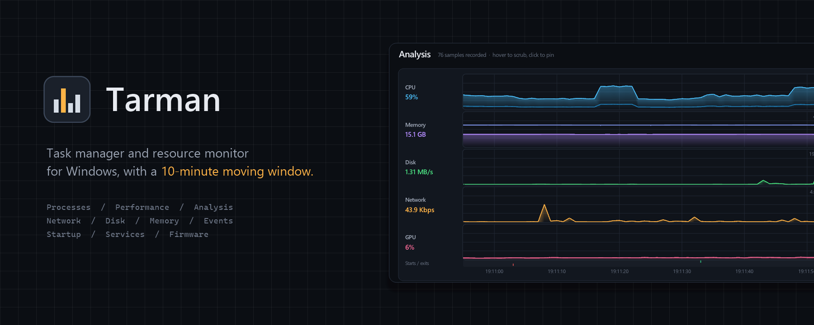
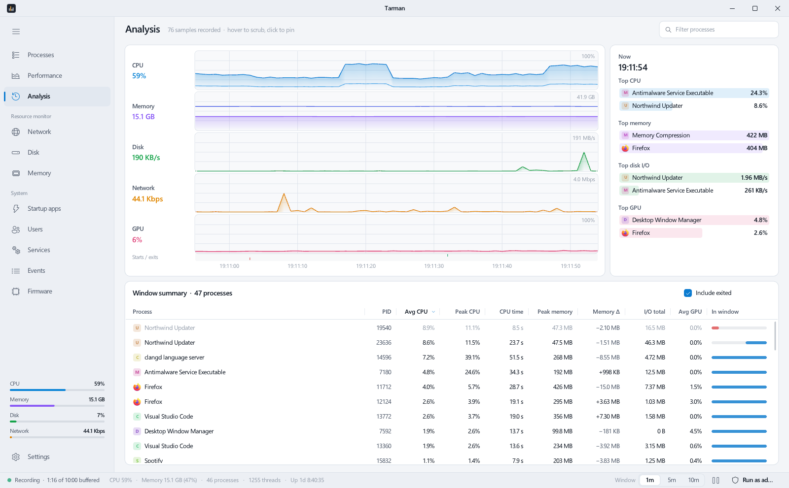
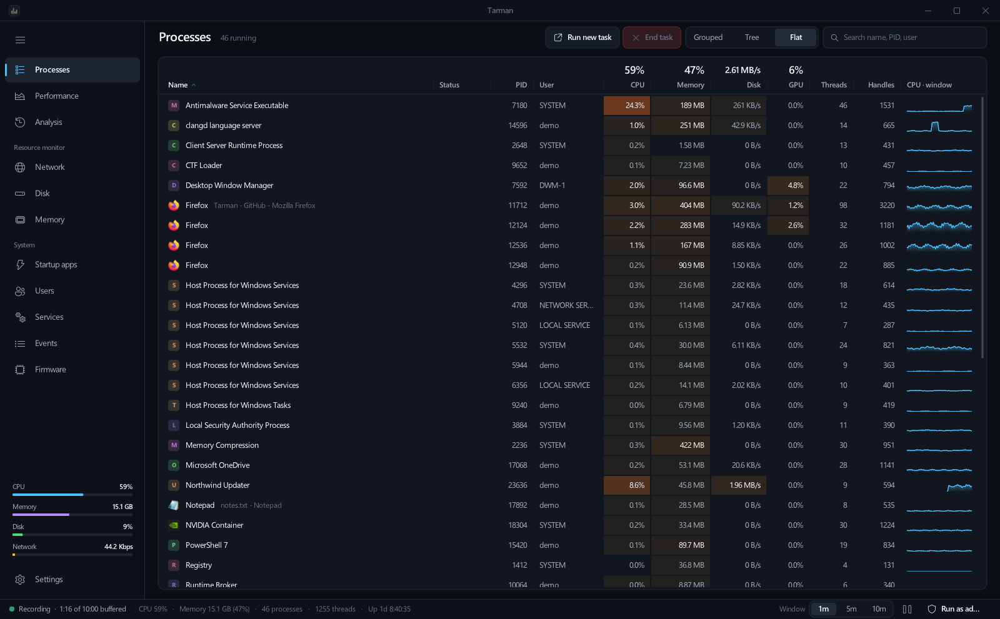
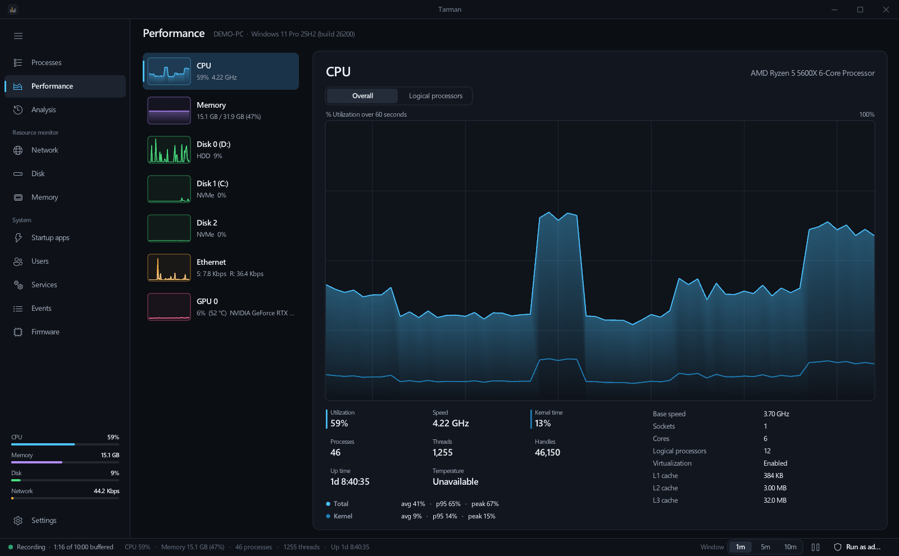
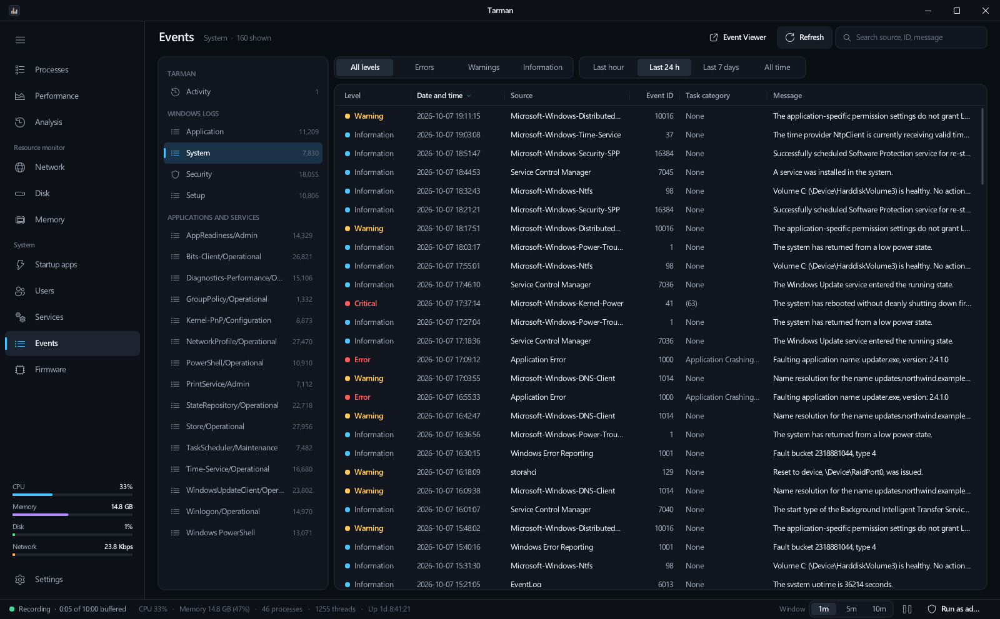

<p align="center">
  
</p>

<p align="center">
  <b>A task manager and resource monitor for Windows, with a 10-minute moving window.</b><br>
  Task Manager and Resource Monitor in one fast native window, plus the history neither of them keeps.
</p>

<p align="center">
  <a href="https://github.com/fezcode/Tarman/releases/latest">Download</a>
  &nbsp;&middot;&nbsp;
  <a href="#features">Features</a>
  &nbsp;&middot;&nbsp;
  <a href="#building-from-source">Build</a>
  &nbsp;&middot;&nbsp;
  <a href="#command-line">Command line</a>
</p>

---

Something spiked a few minutes ago and is gone now. Task Manager can't tell you what it was.
Tarman records every metric, both system-wide and per process, once a second for ten minutes.
Hover over any graph to scrub back through time, then click to pin that moment and see which processes
were using the CPU, memory, disk and GPU at that second. That includes processes that have
already exited.

It is written in C11 on [raylib](https://www.raylib.com/) with a Win32 sampler thread. The download is
a single small executable with no runtime, and it uses under one percent of the CPU while it watches
everything else.

## Features

### The 10-minute window

- **One clock for everything.** System and per-process histories share one sample clock, so a cursor
  position means the same second on every graph. Hover any graph to move the cursor everywhere;
  click to pin it.
- **Analysis page.** CPU, memory, disk, network and GPU are stacked on one time axis, with process
  start and exit ticks underneath. The panel beside it lists the top processes for CPU, memory, I/O
  and GPU at the cursor or the pinned moment.
- **Window summary.** For each process over the window: average and peak CPU, CPU time, peak memory,
  **memory growth** (a quick way to spot a leak), total I/O and average GPU. The table includes
  processes that exited during the window and shows each one's lifetime as a bar.
- **Zoom.** Switch the visible window between 1, 5 and 10 minutes. Recording continues either way.

<p align="center"></p>

### Everything from Task Manager

| Page | What it covers |
|---|---|
| **Processes** | Grouped (Apps / Background / Windows), parent-child tree or flat list. CPU, memory, disk and GPU cells are colour-coded by load, and every row has a 10-minute CPU sparkline. A details panel shows the process's own graphs, every property and its loaded modules. |
| **Performance** | CPU (overall or per logical processor, kernel time, speed, caches, temperature where available), memory (composition, commit, slots and speed from SMBIOS), every disk, every network adapter, and every GPU with 3D / Copy / Video Encode / Video Decode engines, dedicated and shared memory, temperature, fan and power. |
| **Startup apps** | Registry Run keys and Startup folders. Enable and disable use the same `StartupApproved` entries as Task Manager. |
| **Users** | Signed-in sessions with per-user CPU, memory, disk and GPU totals. Disconnect or sign off. |
| **Services** | Every Win32 service with its status, start type and PID. Start, stop or restart a service. |

Right-click any process, anywhere it appears, for: End task, End process tree, Suspend / Resume,
Efficiency mode, Set priority, Set affinity, Create memory dump file, Open file location,
Search online, Properties, and Copy name / PID / path / command line.

<p align="center"></p>

### Everything from Resource Monitor

| Page | What it covers |
|---|---|
| **Network** | Adapter throughput, every TCP and UDP socket with its owning process, and listening ports. |
| **Disk** | Active time, response time and queue length per physical disk, processes doing I/O, and volume usage. |
| **Memory** | A physical memory map (hardware reserved, in use, modified, standby, free), commit charge, hard faults per second, and a per-process breakdown of commit, working set, shareable and private memory. |

<p align="center"></p>

### And a little beyond

- **Events.** An event log explorer for Application, System, Security, Setup and every non-empty
  *Applications and Services* channel. It has level and time filters, search, the full formatted
  message or the raw XML for each event, and a jump straight to the process that logged it.
  It also shows Tarman's own **activity log**: every action you took, every failure, and every
  process start and exit the sampler saw. Actions and errors are also written to
  `%APPDATA%\Tarman\logs`.
- **Firmware.** A read-only view of BIOS / UEFI: vendor, version and capabilities; Secure Boot,
  TPM, virtualization and VBS state; system, motherboard and processor SMBIOS data; memory slots
  with part numbers. With administrator rights it also shows the UEFI boot order. It is read when
  you open the page, never polled.
- **Custom title bar** that keeps everything Windows gives a real one: drag, double-click to
  maximize, Aero Snap, and the Windows 11 snap layouts on the maximize button.
- **Hisashi menubar.** File, Edit, View, Process and Help menus appear in
  [Hisashi](https://github.com/fezcode/Hisashi)'s macOS-style menubar over the hoswl protocol,
  with live check marks and enabled states. You can switch this off in Settings.
- **Dark and light themes**, interface scaling on top of display scaling, always on top, and a
  frame rate that drops when you are not interacting, so the monitor stays quiet.

<p align="center"></p>

## Install

Download `Tarman-Setup-0.1.0.exe` from the
[latest release](https://github.com/fezcode/Tarman/releases/latest) and run it. It installs per user
into `%LOCALAPPDATA%\Programs\Tarman` and needs no administrator rights. The wizard offers
Desktop and Start Menu shortcuts, and Tarman appears in *Apps & features* for a clean uninstall.

Tarman opts in to the [Airlift](https://github.com/fezcode/Airlift) catalog, so Airlift can install and
update it alongside the other Fezcode apps.

Settings and activity logs live in `%APPDATA%\Tarman`. Uninstalling keeps them unless you tick
*Also remove my settings and data*.

### Administrator rights

Tarman runs as your user. Some actions need elevation, and Tarman tells you when they do:
ending protected processes, controlling services, changing machine-wide startup entries,
reading the Security log, and reading UEFI variables. **Run as admin** in the status bar relaunches
it elevated.

### Temperatures

GPU temperature, fan speed and power come from the graphics driver, the same source Task Manager
uses. Windows has no CPU temperature API that works without a driver. Tarman reads ACPI
thermal zones when the firmware exposes them. If
[LibreHardwareMonitor](https://github.com/LibreHardwareMonitor/LibreHardwareMonitor) or
[HWiNFO](https://www.hwinfo.com/) (with shared memory enabled) is running, Tarman picks up the real
CPU package temperature from it automatically.

## Keyboard shortcuts

| Keys | Action |
|---|---|
| `Ctrl+1` ... `Ctrl+9` | Switch pages |
| `Ctrl+F` | Search processes |
| `Ctrl+N` | Run new task |
| `Del` | End the selected task |
| `Enter` | Toggle the details panel |
| `Space` | Pause / resume recording |
| `Ctrl+Plus` / `Ctrl+Minus` / `Ctrl+0` | Interface scale |
| `Esc` | Clear search, close menus, unpin the timeline |
| `F1` | About and shortcuts |

## Command line

```
tarman [options]
  -h, --help              Show help
  -v, --version           Print the version
  --page NAME             Open on a page: processes, performance, analysis, network,
                          disk, memory, startup, users, services, events, firmware, settings
  --light | --dark        Force the theme for this run
  --size WxH              Window size in logical pixels for this run
  --window SECONDS        Visible time window: 60, 300 or 600
  --log CHANNEL           Events page source, e.g. System (default: Tarman activity)
  --screenshot FILE       Render, save a PNG of the window after --wait seconds, exit
  --wait SECONDS          Delay before --screenshot (default 4)
  --export-ico FILE       Write the application icon as a multi-size .ico and exit
  --demo                  Show a synthetic machine (for screenshots); actions are disabled
```

The screenshots in this README are taken with `--demo`, which replaces the process list, user,
computer name and event logs with a made-up machine.

## Building from source

Requirements: [MSYS2](https://www.msys2.org/) with the MinGW-w64 toolchain, CMake, Ninja and raylib:

```
pacman -S mingw-w64-x86_64-gcc mingw-w64-x86_64-cmake mingw-w64-x86_64-ninja mingw-w64-x86_64-raylib
```

Then from PowerShell:

```powershell
.\build.ps1          # Release build into .\build (tarman.exe + glfw3.dll)
.\build.ps1 -Run     # build and launch
.\installer.ps1      # build, verify and package dist\installer\Tarman-Setup-<version>.exe
.\version.ps1        # report the version everywhere it lives
```

The installer is built with [Forge](https://github.com/fezcode/Forge), expected as a sibling
`..\Forge` checkout. `AGENTS.md` describes the release flow.

### How it is put together

```
src/sys_win.c        sampler thread: NtQuerySystemInformation, PDH, IP Helper, SCM, WTS, D3DKMT
src/sys_events.c     Windows event logs (wevtapi), queried on a background thread
src/sys_firmware.c   SMBIOS, UEFI variables, TPM, Secure Boot
src/sys_window.c     the custom title bar (WM_NCCALCSIZE / WM_NCHITTEST subclass)
src/ui.c             immediate-mode widgets, crisp 1:1 font rendering, time-series graphs
src/page_*.c         one file per page
src/menubar.c        Hisashi menubar integration (hoswl)
```

Win32 and raylib never meet in one translation unit; `src/sys.h` is the plain-C boundary between
them. Every ring buffer is indexed by the same sample number, which is what makes "what was
happening at 14:32:05" a single array read.

## License

[MIT](LICENSE.txt) &copy; 2026 Fezcode
